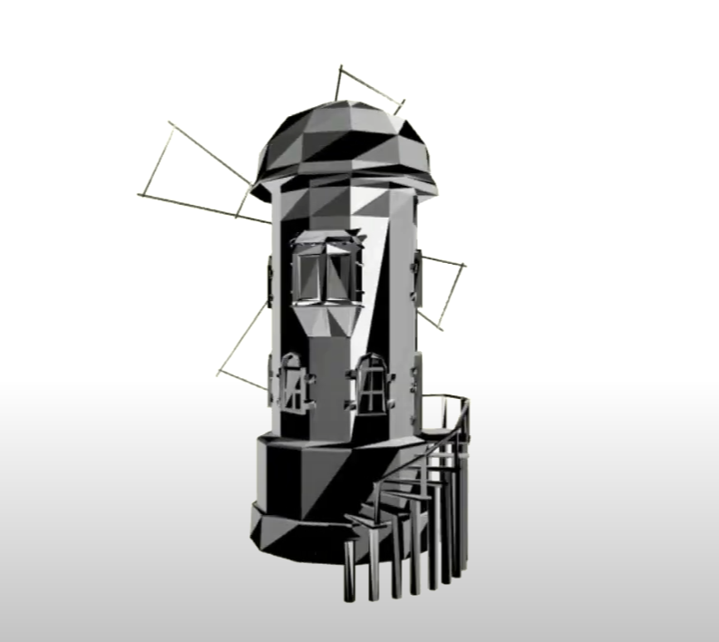
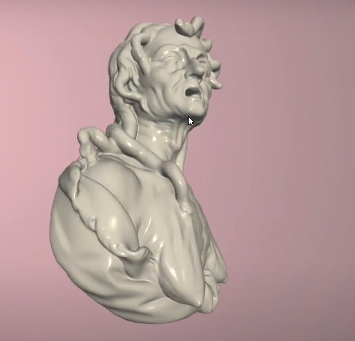

# WebGL_Obj_Loader

This is an Obj Loader built on WebGL.

Obj file is tricky format is work with and it is always hard to make player work with all obj, if it doesnot work for your file, i will release a guide on reformatting Obj
file to make it Compatabile.

Thsi is demo that you would love to check:

and

